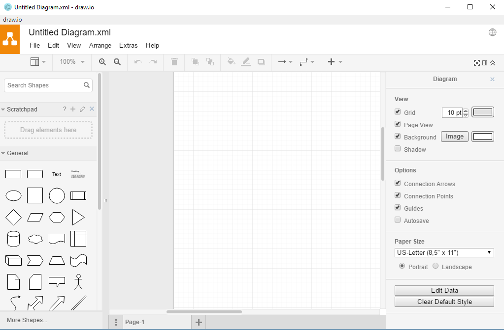

About
----- 

**drawio-desktop** is a **draw.io** desktop app based on [Electron](https://electronjs.org/)

**draw-io desktop** uses [draw-io](https://github.com/jgraph/drawio). draw.io uses the [mxGraph library](https://github.com/jgraph/mxgraph) as the base of the stack, with the [GraphEditor example](https://github.com/jgraph/mxgraph/tree/master/javascript/examples/grapheditor) from mxGraph as the base of the application part. 

[Edit this image](https://www.draw.io/#Hjgraph%2Fdrawio-desktop%2Fmaster%2Fdependency-diagram.png)

Setup:

**draw.io** is a git submodule of **drawio-desktop**. To get both you need to clone recursively:

`git clone --recursive https://github.com/jgraph/drawio-desktop.git`

To run this:
1. npm install (in the root directory of this repo)
2. npm install (in the drawio directory of this repo)
2. export NODE_ENV=development
3. npm start

To release:
1. Update the draw.io sub-module and push the change
2. Wait for the builds to complete (https://travis-ci.org/jgraph/drawio-desktop and https://ci.appveyor.com/project/davidjgraph/drawio-desktop)
3. Go to https://github.com/jgraph/drawio-desktop/releases, edit the preview release and publish it.
